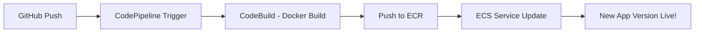

# 🚀 Node.js Hello World App on AWS ECS Fargate (CI/CD Pipeline)

This project demonstrates deploying a simple **Node.js Hello World** application using **Docker**, **AWS ECR**, **ECS Fargate**, and a complete **CI/CD pipeline** with **AWS CodePipeline** and **CodeBuild**.

---

## 🧱 Project Structure

```
nodejs-hello-ecs/
├── app.js              # Node.js Express application
├── Dockerfile          # Container definition
├── buildspec.yml       # CodeBuild build and deploy steps
├── package.json        # Project metadata and dependencies
└── .dockerignore       # Files to ignore during Docker build
```

---

## ✅ Prerequisites

Before starting, ensure you have:

- AWS account with IAM permissions
- AWS CLI installed and configured
- Docker installed and running
- Git + GitHub account
- Node.js (v18+ recommended)

---

## ⚙️ AWS Configuration Steps

### 1️⃣ Set up AWS CLI

```bash
aws configure
```

Provide:

- Access Key ID  
- Secret Access Key  
- Region (e.g., `us-west-1`)  

---

### 2️⃣ Create ECR Repository

```bash
aws ecr create-repository   --repository-name nodejs-hello-ecs   --region <your-region>
```

---

## 🐳 Docker Image (Local Build & Test)

To build and test the Docker image locally:

```bash
docker build -t nodejs-hello-ecs .
docker run -p 3000:3000 nodejs-hello-ecs
```

Visit `http://localhost:3000`

---

## 🚀 Deploying to ECS Fargate (Manual via Console)

### 🏗️ Create ECS Cluster

1. Go to **ECS > Clusters > Create Cluster**
2. Select **"Networking only" (Fargate)**
3. Name it `nodejs-fargate-cluster`
4. Choose appropriate VPC/subnets and click **Create**

---

### ⚙️ Create ECS Task Definition

1. Go to **ECS > Task Definitions > Create new**
2. Type: **FARGATE**
3. Name: `nodejs-task`
4. Task role: None or minimal IAM
5. Task memory: `512 MiB`, CPU: `256`
6. Add container:
   - Name: `nodejs-container`
   - Image URI: `<your_account_id>.dkr.ecr.<region>.amazonaws.com/nodejs-hello-ecs:latest`
   - Port: `3000`
7. Save and **Create**

---

### 🌐 Create ECS Service

1. Go to your **Cluster > Services > Create**
2. Launch type: `FARGATE`
3. Task Definition: `nodejs-task`
4. Service name: `nodejs-hello-service`
5. Number of tasks: `1`
6. Load balancer:
   - (Optional) Create an Application Load Balancer (ALB) for public access

---

## 🛠️ CI/CD Pipeline

This project uses **CodePipeline + CodeBuild** to automate Docker image builds and ECS deployments.

---

## 🧪 CodeBuild Setup (Manual)

1. Go to **CodeBuild > Create Build Project**
2. Name: `nodejs-hello-build`
3. Source:
   - Provider: `GitHub (App)`
   - Connect your GitHub
   - Repo & branch: e.g., `main`
4. Environment:
   - Runtime: `Managed image`
   - OS: `Ubuntu`, Image: `aws/codebuild/standard:7.0`
   - Privileged: ✅ (for Docker builds)
   - IAM role: Auto-create or use existing with ECR permissions
5. Buildspec: Use `buildspec.yml` from repo
6. Environment Variables:
   - `ECR_REPO_URI`: `<your_account_id>.dkr.ecr.<region>.amazonaws.com/nodejs-hello-ecs`
   - `AWS_REGION`: `<your-region>`

---

## 🔁 CodePipeline Setup (Manual)

1. Go to **CodePipeline > Create Pipeline**
2. Name: `nodejs-hello-pipeline`
3. Source:
   - Provider: `GitHub (App)`
   - Select your repo and branch (`main`)
   - Enable webhook trigger
4. Build:
   - Provider: `CodeBuild`
   - Select `nodejs-hello-build`
5. Deploy:
   - Provider: `Amazon ECS (Fargate)`
   - Select:
     - Cluster: `nodejs-fargate-cluster`
     - Service: `nodejs-hello-service`
     - Image definitions: `imagedefinitions.json`

---

## 📜 buildspec.yml Overview

Located in the repo root.

```yaml
version: 0.2

phases:
  pre_build:
    commands:
      - echo Logging into Amazon ECR...
      - aws ecr get-login-password --region $AWS_REGION | docker login --username AWS --password-stdin $ECR_REPO_URI
      - IMAGE_TAG=$(echo $CODEBUILD_RESOLVED_SOURCE_VERSION | cut -c 1-7)
  build:
    commands:
      - docker build -t $ECR_REPO_URI:$IMAGE_TAG .
      - docker tag $ECR_REPO_URI:$IMAGE_TAG $ECR_REPO_URI:latest
  post_build:
    commands:
      - docker push $ECR_REPO_URI:$IMAGE_TAG
      - docker push $ECR_REPO_URI:latest
      - printf '[{"name":"nodejs-container","imageUri":"%s"}]' $ECR_REPO_URI:$IMAGE_TAG > imagedefinitions.json

artifacts:
  files:
    - imagedefinitions.json
```

---

## 🔁 CI/CD Flow Summary



---

## 🧪 How to Trigger Deployment

1. Edit `app.js`, for example:

```js
res.send('<h1 style="color: blue;">Hello from updated ECS!</h1>');
```

2. Commit and push:

```bash
git add .
git commit -m "Update message"
git push origin main
```

3. CodePipeline will:
   - Fetch code from GitHub
   - Run CodeBuild to build & push Docker image
   - Update ECS service with new image

---

## 🔐 Security Tips

- Use IAM roles with least privileges for CodeBuild and ECS Task
- Do **not** hardcode credentials—use roles or AWS Secrets Manager
- Enable logging and monitoring using **CloudWatch**
- Encrypt ECR, S3 (artifact store), and enable ALB/WAF for production

---


---

## 🙌 Author

**Vikas Tyagi**  
Feel free to fork or submit issues/pull requests for improvements.
